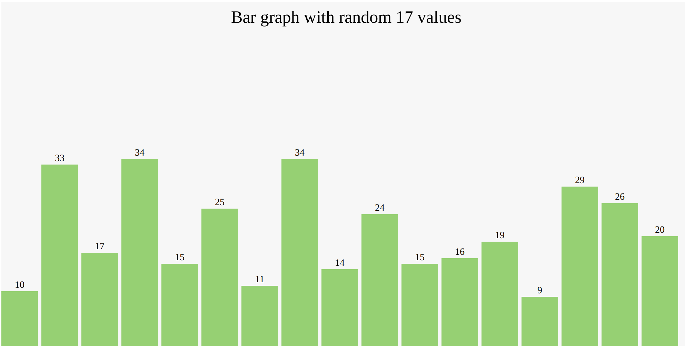

# Bar Chart Example
The code on file app.js will generate a random array of n numbers that will be plotted to the file index.html when rendered in the browser.

It will create using D3.js a nice bar chart of n bars with title and labels.

